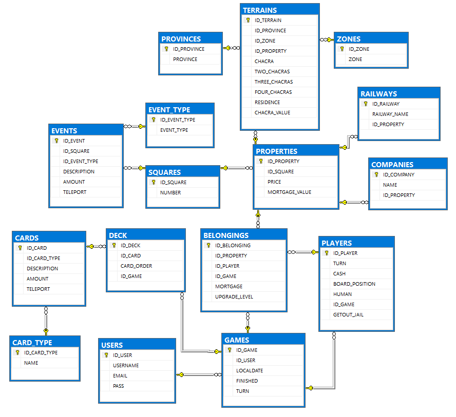

# TPI "Estanciero"

## 📑 Índice

1. [🎯 Introducción](#-introducción)  
2. [🎯 Objetivos](#-objetivos)  
3. [🎮 Funcionalidades principales](#-funcionalidades-principales)  
4. [🗃️ Diagrama de base de datos](#-diagrama-de-base-de-datos)  
5. [🧩 Diagrama de clases](#-diagrama-de-clases)  
6. [✅ Estándares técnicos de desarrollo cumplidos](#-estándares-técnicos-de-desarrollo-cumplidos)  
7. [🤝 Forma de trabajo colaborativa](#-forma-de-trabajo-colaborativa)  
8. [📚 Documentación adicional](#-documentación-adicional)  
9. [👥 Integrantes del grupo con los que realicé el trabajo](#-integrantes-del-grupo-con-los-que-realicé-el-trabajo)

## Introducción

El juego del Estanciero es una adaptación argentina del clásico juego de mesa Monopoly. Fue creado en 1942, y desde 
entonces ha sido un juego de mesa popular en Argentina y otros países de habla hispana. El nombre "Estanciero" hace 
referencia al término utilizado en Argentina para referirse a los propietarios de grandes extensiones de tierra, también 
conocidos como estancias. Este juego recrea la dinámica económica de la compra, venta y desarrollo de propiedades, así 
como la gestión de recursos financieros. El objetivo del juego es acumular la mayor cantidad de dinero y propiedades 
posibles, mientras se intenta evitar la bancarrota. Los jugadores recorren un tablero que representa un mapa ficticio de 
Argentina, en el que pueden comprar diferentes tipos de propiedades, como estancias, campos, estaciones de tren, 
etc. Además, se enfrentan a diferentes eventos y situaciones que pueden afectar su economía, como impuestos, 
mejoras en las propiedades, alquileres, entre otros. Los jugadores compiten entre sí para adquirir propiedades 
estratégicas y construir sobre ellas para aumentar su valor y generar ingresos. El juego se desarrolla a lo largo de 
varias rondas, y el jugador que logre acumular la mayor cantidad de riqueza al final del juego es declarado el ganador.

En este contexto, como parte de la materia Laboratorio de Computación III, se presenta el desafío de desarrollar el 
juego de “El Estanciero” funcional en Java. Este desafío no solo requiere conocimientos técnicos en programación, sino 
también una comprensión profunda de las reglas y la lógica del juego, así como la capacidad de aplicar conceptos 
aprendidos en las clases para crear un juego interactivo y totalmente funcional.

## Objetivos

El objetivo principal de este trabajo integrador es aplicar los conocimientos adquiridos durante las clases de 
Laboratorio de Computación III para desarrollar el juego del estanciero completamente funcional en Java. Esto implica 
diseñar e implementar un programa que permita a un jugador competir contra jugadores autómatas, siguiendo todas las 
reglas del juego y permitiendo las funcionalidades esenciales del, como la compra y venta de propiedades, el cálculo de 
alquileres, el manejo de dinero, entre otros aspectos.

El juego desarrollado también debe incluir características avanzadas que demuestren la comprensión y aplicación de los 
conceptos de programación aprendidos, como la implementación de patrones de diseño, la gestión eficiente de la memoria, 
la modularidad y la reutilización de código, la manipulación de estructuras de datos complejas, la implementación de 
algoritmos de búsqueda y evaluación de estados del juego. También deben aplicarse los conocimientos adquiridos sobre la 
gestión del código fuente, su versionado y manipulación.

El desarrollo del juego en Java requerirá la aplicación de conocimientos de programación orientada a objetos, manejo de 
estructuras de datos, algoritmos, manejo de interfaces gráficas de usuario, pruebas unitarias, y el uso de herramientas 
como Maven, JUnit, Mockito y JaCoCo, entre otros.

**Este proyecto no solo permitirá a los estudiantes aplicar los conceptos y técnicas aprendidas en el aula, sino que 
también los desafiará a enfrentarse a situaciones reales de desarrollo de software, como la planificación, diseño, 
implementación, pruebas y entrega de una aplicación de software completa y funcional.** Además, el uso de herramientas de 
control de versiones y la colaboración en un entorno de desarrollo colaborativo como GitHub les brindará una experiencia 
valiosa en el uso de herramientas profesionales ampliamente utilizadas en la industria.

**_Opcionalmente_**, los alumnos podrán desarrollar (en un proyecto aparte) una interfaz 
gráfica que se integre al proyecto de BackEnd mediante apis Rest y que sea visualmente atractivo y fácil de usar, que 
permita al jugador interactuar de manera intuitiva con los elementos del juego.

# 🎮 Funcionalidades principales

A continuación se detallan las funcionalidades implementadas en el proyecto, en base a los **requerimientos funcionales** establecidos en el Trabajo Práctico Integrador de la materia **Laboratorio de Computación III**. Estas funcionalidades reflejan los objetivos técnicos y lógicos alcanzados.

## 📦 Contenido del juego simulado

- Simulación de tablero de juego con casillas representando propiedades, estaciones, eventos y situaciones especiales.
- Implementación de:
  - 6 peones (jugadores: 1 humano y hasta 4 bots).
  - 29 tarjetas de escrituras (propiedades).
  - 32 tarjetas de "Suerte y Destino".
  - Chacras, estancias, ferrocarriles.
  - Dados y billetes virtuales.

## 🎮 Inicio del juego

- El jugador puede iniciar la partida y elegir entre tres niveles de dificultad:
  - **Fácil**: 2 bots (1 moderado, 1 conservador).
  - **Medio**: 3 bots (1 agresivo, 1 moderado, 1 conservador).
  - **Difícil**: 4 bots (1 agresivo, 2 moderados, 1 conservador).
- Se define el orden de turno según tiradas de dados iniciales.
- Posibilidad de activar una condición de victoria alternativa por acumulación de dinero.
- Todos los jugadores inician con $35.000 desde la salida.

## 🎲 Movimiento en el tablero

- Lanzamiento de dados y movimiento automático de peones.
- Si el jugador cae en:
  - **Propiedad no adquirida**: puede comprarla.
  - **Propiedad ajena**: paga alquiler automáticamente.
  - **Doble en los dados**: se otorga un turno extra. Al tercer doble consecutivo, el jugador va a la cárcel.
- Gestión automática de pagos y cobros en cada movimiento.

## 🏘️ Compra y venta de propiedades

- Los jugadores pueden comprar propiedades disponibles al caer en ellas.
- Venta de propiedades propias al banco (automática).
- Compra-venta entre jugadores: opción **opcional**, implementada en parte para ciertos perfiles virtuales.

## 🏗️ Construcción de mejoras

- Construcción de **Chacras**, **Campos** y **Estancias** en propiedades adquiridas, si se cumplen los requisitos.
- Mejora exclusiva entre el propietario y el banco.
- Lógica validada por perfil del jugador (porcentaje de dinero disponible, zonas preferidas, etc.).

## 🎭 Eventos y situaciones especiales

- Implementación de:
  - Casillas de **Suerte** y **Destino** con acciones automáticas.
  - **Impuestos** y **Premios** cobrados o pagados automáticamente al banco.
  - **Cárcel**: jugadores deben permanecer detenidos si son enviados, con lógica de liberación.
  - **Casilla de descanso**: permite optar por permanecer hasta dos turnos si no se saca doble.

## 💰 Gestión financiera

- Manejo automatizado de dinero:
  - Compras, ventas, alquileres, impuestos y premios.
- Verificación de fondos antes de realizar operaciones.
- Cálculo de rentabilidad y lógica para evitar bancarrota.

## 🏁 Finalización del juego

- El juego termina cuando:
  - Un jugador alcanza el monto objetivo (si se activó esa condición).
  - Todos los demás jugadores quedan en bancarrota.
- Se muestra un mensaje indicando al jugador ganador.

## 🧠 Perfiles virtuales (bots)

- **Conservador**:
  - Prioriza propiedades baratas (Formosa, Río Negro, Salta).
  - Construye mejoras solo si no superan el 30% de su dinero.
- **Moderado/Equilibrado**:
  - Balance entre propiedades y mejoras (Mendoza, Santa Fe, Tucumán).
  - Construye si mejoras no superan el 50% o cuando el 75% de propiedades fueron vendidas.
  - Busca completar ferrocarriles.
- **Agresivo**:
  - Alta inversión y riesgo (Tucumán, Córdoba, Buenos Aires).
  - Compra todo lo posible si completó sus zonas.
  - Dispuesto a pagar hasta 200% para completar provincias preferidas.
  - Mejora propiedades en cada oportunidad.

## 🗃️ Diagrama de base de datos

El siguiente diagrama muestra la estructura del sistema de almacenamiento de datos del proyecto.  
Este sistema permite **guardar el estado de las partidas** de los jugadores, de manera que puedan **ser retomadas o consultadas en el futuro**.

## 🧩 Diagrama de clases

A continuación se muestra el **diagrama de clases** del proyecto, que representa las entidades principales del juego y su estructura de métodos:

# ✅ Estándares técnicos de desarrollo cumplidos

Durante el desarrollo del proyecto, se cumplió con los siguientes requerimientos no funcionales establecidos por la consigna del Trabajo Práctico Integrador:

## 📌 Calidad del código y buenas prácticas

- El código sigue las convenciones de codificación de **Java 11**, garantizando legibilidad, mantenibilidad y escalabilidad.
- Se aplicó el **principio de responsabilidad única (SRP)** y otros principios de **diseño SOLID**, promoviendo una arquitectura modular y de alta cohesión.
- La estructura de paquetes está organizada por capas (model, services, entities, etc.), facilitando la navegación, el testing y futuras extensiones del código.

## ⚙️ Herramientas de construcción y gestión

- Se utilizó **Maven** como sistema de construcción y gestión de dependencias.
- El proyecto está estructurado siguiendo buenas prácticas de Maven: uso de `pom.xml`, definición clara de dependencias, y compatibilidad con entornos de integración continua.

## 🧪 Pruebas unitarias y cobertura

- Se implementaron pruebas unitarias utilizando **JUnit** y **Mockito**.
- Se logró una cobertura de código superior al **80%** mediante el uso de **JaCoCo**, cumpliendo con el estándar solicitado por la consigna.
- Las pruebas aseguran el correcto funcionamiento de las clases principales y validan comportamientos clave del juego como:
  - Reglas de movimiento
  - Transacciones de compra/venta
  - Lógica de perfiles virtuales
  - Gestión de eventos y finanzas

---

El cumplimiento de estos requerimientos garantiza no solo un producto funcional, sino también una **base de código profesional**, con estándares de calidad, pruebas y arquitectura sólida.

## 🤝 Forma de trabajo colaborativa

Este proyecto fue desarrollado de forma colaborativa en un equipo de 6 integrantes, fomentando la autogestión, organización interna y comunicación constante entre los miembros del grupo.

- Se aplicó el **workflow GitFlow** para estructurar el desarrollo en ramas: `main`, `develop`, `feature`, `release` y `hotfix`, siguiendo las buenas prácticas aprendidas en clase.
- Utilizamos **Git y GitHub** como herramientas principales de control de versiones y trabajo colaborativo, manteniendo un historial claro y organizado de cambios.
- La coordinación del equipo incluyó:
  - Asignación equitativa de tareas según las fortalezas individuales.
  - Planificación de hitos de desarrollo (diseño, implementación, pruebas, documentación).
  - Comunicación constante y efectiva a través de reuniones y herramientas digitales.
- El repositorio fue gestionado dentro del **GitHub Classroom** habilitado por la cátedra, donde también se organizaron entregas parciales y seguimiento del progreso.

Esta forma de trabajo fortaleció las competencias de desarrollo en equipo, planificación de proyectos y uso profesional de herramientas de versionado.

## 📚 Documentación adicional

- 🎨 **Explicación de la interfaz de usuario**  
  📄 Ver el documento [UXexplanation.md](docs/UXDiagram/UXexplanation.md) para más información sobre la experiencia de usuario implementada.

## Integrantes del grupo con los que realicé el trabajo

- Agustín Nieto - [GitHub](https://github.com/405660-NIETO)
- Lucas Gauffin - [GitHub](https://github.com/406021-GAUFFIN)
- Natanael Barrionuevo - [GitHub](https://github.com/NatanaelBarrionuevo)
- Gabriel Scipioni - [GitHub](https://github.com/GabrielScipioni)
